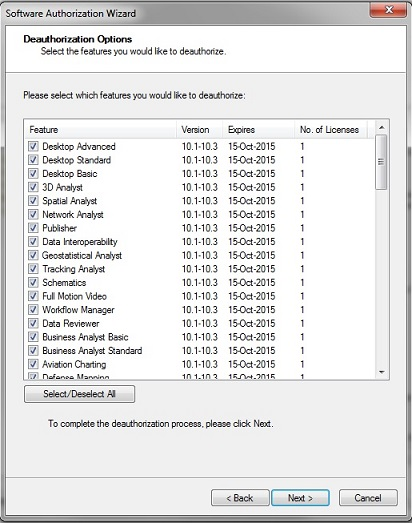

ArcGIS Desktop反註冊程序
========================

摘要
--------

當您要解除安裝ArcGIS Desktop產品之前，**請先反註冊您的Desktop License** ，您才能在其他電腦中繼續使用該組License。如果您沒有反註冊授權，則當該授權註冊次數超過一定上限後，授權程式會提示您該組授權無法再註冊，如下圖所示。如果出現授權無法註冊，請通知產品廠商協助您執行反註冊流程。

   |image4|

步驟
-------

1. 點選反註冊按鈕

    ***使用concurrent-use license的使用者***

    A. 開啟License Manager程式

    B. 點選左側Authorization，然後再點選Deauthorize按鈕

    |image0|

    ***使用single-use licenses的使用者***

    A. 打開ArcGIS Administrator

    B. 點選左側Support Operations，然後再點選Deauthorize按鈕

    |image1|

2. 在Deauthorization Method下，選擇第一個選項Deauthorize with Esri now
   using the Internet，然後按Next

    |image2|
 
3. 勾選要反註冊的產品與擴充模組，然後點選Next完成反註冊程序。

    |image3|

