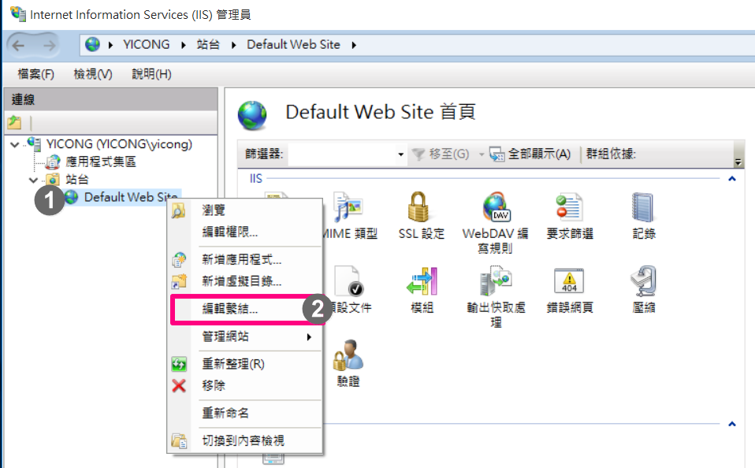

ArcGIS Enterprise安裝前準備
**************************************

開始安裝ArcGIS Enterprise軟體之前，請依照以下流程，確認作業系統版本、硬體需求、資料庫支援版本、電腦名稱、SSL憑證等條件是否滿足您要安裝的ArcGIS Enterprise版本條件。

.. _h059745d4a128312442282c4664717f:

確認作業系統版本、硬體資源、資料庫支援版本
==========================================

你可以在以下網頁中，切換Other versions選單，到您要安裝版本查詢。Other versions選單切換示意圖如下

\ |IMG1|\ 

+------------------+-----------+
|ArcGIS for Server |\ |LINK1|\ |
+------------------+-----------+
|Portal for ArcGIS |\ |LINK2|\ |
+------------------+-----------+
|ArcGIS Data Store |\ |LINK3|\ |
+------------------+-----------+
|ArcGIS Web Adaptor|\ |LINK4|\ |
+------------------+-----------+

.. _h6a2012201b74a5777471f3553737921:

確認具有足夠的License
=====================

安裝ArcGIS Enterprise時，有兩個元件需要License進行授權，分別是

#.  \ |STYLE1|\ 

#.  \ |STYLE2|\ 

這兩個元件的序號並不相同，\ |STYLE3|\ 。

.. _h174fb648377959437b5c1f697c1c40:

電腦名稱
========

..  Note:: 
    1.  ArcGIS for Server不支援含有底線"_"的電腦名稱
    2.  設定完整電腦名稱會需要重新開機

如果您決定安裝Portal for ArcGIS元件，則必須為機器設定完整的電腦名稱，例如name.domain.com.tw。

windows作業系統步驟如下：

1. 在資料夾中，對\ |STYLE6|\ 點選滑鼠右鍵➨選擇\ |STYLE7|\ 

   \ |IMG2|\ 
   

2. 在電腦的基本資訊視窗中，檢查『\ |STYLE8|\ 』是否有附加網域名稱(如.com.tw)。如果沒有，點選『\ |STYLE9|\ 』

   \ |IMG3|\ 

3. 在系統內容視窗中，點選\ |STYLE10|\ 

   \ |IMG4|\ 
   

4. 在電腦名稱/網域變更視窗中，點選\ |STYLE11|\ 按鈕

   \ |IMG5|\ 

5. 輸入網域名稱，本案例為igis.com.tw，然後按確定

   \ |IMG6|\ 

6. 在電腦名稱/網域變更視窗中，確認電腦名稱已經加上網域名稱。沒有問題請按確定

   \ |IMG7|\ 
   

7. 點選確定，進行重開機作業

   \ |IMG8|\ 
   

8. 開機完成後，開啟資料夾，對本機點選滑鼠右鍵選擇內容

9.  在電腦的基本資訊視窗，確定完整電腦名稱具備網域名稱。沒問題的話，直接關閉此視窗即可。

   \ |IMG9|\ 
   

.. _h5a596c4a182749355f1137193a445e1:

SSL憑證
=======

如果您決定安裝Portal for ArcGIS元件，則您必須\ |STYLE12|\ ，網頁伺服器內(例如IIS或Apache Tomcat)，為您的網站匯入與繫結憑證。

如果您使用Windows作業系統，且沒有立即可用的憑證，則您可以依照下列步驟在IIS中建立自我簽署憑證，並繫結到網站站台中

1. 開起 IIS 管理員

2. 左側點選伺服器按鈕，右側面板中\ |STYLE13|\ 伺服器憑證	

   \ |IMG10|\ 
   

3. 右側選單中，點選的建立自我簽署憑證

   \ |IMG11|\ 
   

4. 在輸入欄中，輸入一個可以辨識的名稱，然後按確定
   
   \ |IMG12|\ 
   
5. 在功能檢視視窗中，會出現你剛剛建立的自我簽署憑證。

   \ |IMG13|\ 
   
6. 在左側中，展開站台資料夾。對Default Web Site按滑鼠右鍵，選擇編輯繫結

   \ |IMG14|\ 

7. 點選新增按鈕

   \ |IMG15|\ 
   
8. 在類型選擇HTTPS，SSL憑證選擇剛剛建立好的憑證，然後按確定

   \ |IMG16|\ 

9. 確定HTTPS協定已被啟用。沒有問題的話，按關閉按鈕關閉視窗。

   \ |IMG17|\ 
   
.. bottom of content

.. |STYLE1| replace:: **ArcGIS for Server**

.. |STYLE2| replace:: **Portal for ArcGIS**

.. |STYLE3| replace:: **因此您必需備妥以上兩元件的License**

.. |STYLE6| replace:: **本機**

.. |STYLE7| replace:: **內容**

.. |STYLE8| replace:: **完整電腦名稱**

.. |STYLE9| replace:: **變更設定**

.. |STYLE10| replace:: **變更**

.. |STYLE11| replace:: **其他(M)..**

.. |STYLE12| replace:: **在安裝ArcGIS Web Adaptor的機器上**

.. |STYLE13| replace:: **點兩下**

.. |LINK1| raw:: html

    <a href="https://server.arcgis.com/en/server/latest/install/windows/arcgis-server-system-requirements.htm" target="_blank">系統需求頁面</a>

.. |LINK2| raw:: html

    <a href="https://server.arcgis.com/en/portal/latest/install/windows/portal-for-arcgis-system-requirements.htm" target="_blank">系統需求頁面</a>

.. |LINK3| raw:: html

    <a href="https://server.arcgis.com/en/data-store/latest/install/windows/arcgis-data-store-system-requirements.htm" target="_blank">系統需求頁面</a>

.. |LINK4| raw:: html

    <a href="https://server.arcgis.com/en/web-adaptor/latest/install/iis/arcgis-web-adaptor-system-requirements.htm" target="_blank">系統需求頁面</a>

