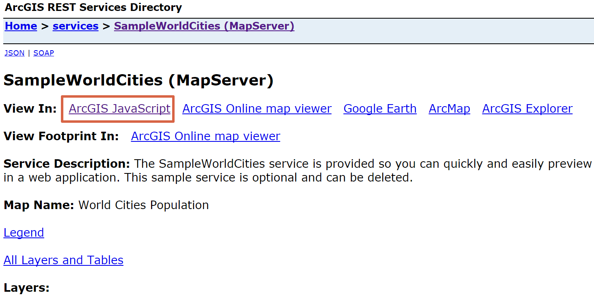
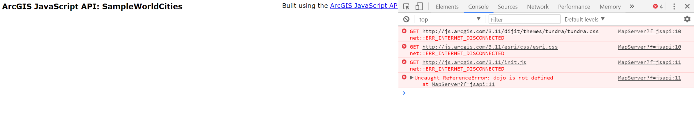

.. _h4a6f513573e3e473f1b7e51162e234:

離線環境下，安裝ArcGIS API for Javascript
*****************************************

.. _h1634483c7822441972316c7301545:

摘要
====

當伺服器沒有連接外部網路時，會無法使用ArcGIS Javascript預覽程式瀏覽網路服務。因為該項功能預設是使用線上的程式庫，如果電腦無法連接外部網路，預覽程式就無法下載程式庫來使用。

解決方式是將ArcGIS Javascript程式庫安裝佈署在自己的機器上，並設定預覽程式使用本地端的程式庫，如此ArcGIS Javascript預覽程式便能在離線環境下正常運作。

\ |IMG1|\ 

\ |IMG2|\ 

.. _h174fb648377959437b5c1f697c1c40:

安裝流程
========

要將ArcGIS API for Javascript程式庫安裝佈署在本地端，會需要完成以下幾件事項：

#. 下載ArcGIS API for Javascript程式庫

#. 修改程式庫內部設定(init.js與dojo.js)

#. 將程式庫架設在Web Sever上

#. 設定預覽程式使用剛剛架設好的程式庫

以下就一一說明每一項的實作步驟

.. _h4915454056a354153753640145f7140:

下載ArcGIS API for Javascript程式庫
-----------------------------------

#. 使用\ |STYLE0|\ 或\ |STYLE1|\ 登入\ |LINK1|\ 

#. 在儀錶板中，點選Download APIs, SDKs & data按鈕

#. Product選擇ArcGIS API for Javascript，版本選擇3.X版，本文使用3.23版

#. 點選API按鈕下載程式庫壓縮檔

#. 解壓縮程式庫

.. _h15f7a5a1d44422621733404d723453:

修改程式庫內部設定(init.js與dojo.js)
------------------------------------

.. _h5d212d451c266e5566484e5f6c3c27:

將程式庫架設在Web Sever上
-------------------------

如果您使用Windows作業系統，請可以依照以下步驟完成程式庫架設。如果不是，則請參閱您要使用的Web Server軟體進行架設。

.. _h56a41143b2a3f40427e7a356617232:

設定預覽程式使用剛剛架設好的程式庫
----------------------------------

.. bottom of content

.. |STYLE0| replace:: **開發者帳號**

.. |STYLE1| replace:: **ArcGIS Online訂閱帳號**

.. |LINK1| raw:: html

    <a href="https://developers.arcgis.com/" target="_blank">ArcGIS開發者網站</a>

