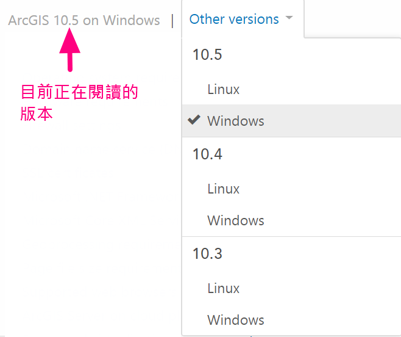
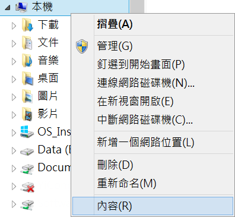
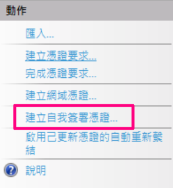
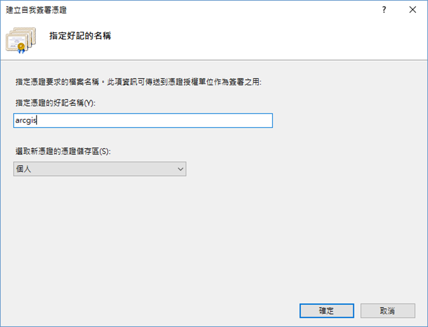

ArcGIS Enterprise安裝流程
=========================

摘要
----

ArcGIS Enterprise產品包含4個主要元件，分別是ArcGIS for Server、Portal
for ArcGIS、ArcGIS Data Store、ArcGIS Web
Adaptor。安裝時\ **一定要先安裝ArcGIS for
Server**\ ，其他三個元件的安裝順序沒有強制性。筆者慣用的軟體安裝與更新順序如下，提供給讀者參考

1. ArcGIS for Server

2. ArcGIS Data Store

3. Portal for ArcGIS

4. ArcGIS Web Adaptor

四個元件功能概述如下：

+----------------------+-----------------------------------------------------------------------------------------------------------------------------------------------------------------------------------------------------------------------------------------+
| 產品名稱             | 功能描述                                                                                                                                                                                                                                |
+======================+=========================================================================================================================================================================================================================================+
| ArcGIS for Server    | ArcGIS for Server主要用途是提供網路服務功能。在管理介面中，您可以任意開啟或關閉指定的網路服務；您也可以為站臺加入多台機器，提高網站的效能及應變能力。                                                                                   |
+----------------------+-----------------------------------------------------------------------------------------------------------------------------------------------------------------------------------------------------------------------------------------+
| Portal for ArcGIS    | Portal for ArcGIS主要用途是提供入口網站後台的功能。透過Portal可以，您快速整合ArcGIS for Server所提供的網路服務、建立線上地圖，並藉由多元的應用程式樣板，達到敏捷開發與快速應變的能力。                                                  |
+----------------------+-----------------------------------------------------------------------------------------------------------------------------------------------------------------------------------------------------------------------------------------+
| ArcGIS Data Store    | ArcGIS Data Store主要用途是作為Portal for ArcGIS入口網站的資料庫。它內建圖徵圖層、快取圖層、3D場景圖層以及大量時空數據資料的儲存結構定義檔，讓使用者可以透過入口網站Portal for ArcGIS，輕鬆將手邊數據資料分享呈多元的網路服務。         |
|                      |                                                                                                                                                                                                                                         |
|                      | 資料本體儲存在ArcGIS Data Store的網路服務，在項目說明頁面會出現\ **(託管)**\ 的字樣。                                                                                                                                                   |
+----------------------+-----------------------------------------------------------------------------------------------------------------------------------------------------------------------------------------------------------------------------------------+
| ArcGIS Web Adaptor   | ArcGIS Web Adaptor是佈署在網頁伺服器(如IIS、Apache Tomcat)上的應用程式，可以將來自客戶端的請求轉送至Portal for ArcGIS或ArcGIS for Server的電腦，讓您可以使用80 (http)或443 (https)連接埠公開ArcGIS for Server以及 Portal for ArcGIS。   |
|                      |                                                                                                                                                                                                                                         |
|                      | 如果網頁伺服器支援使用組織身份儲存庫和安全性原則的功能，便能提供單一登入或其他自訂身分驗證的體驗。                                                                                                                                      |
+----------------------+-----------------------------------------------------------------------------------------------------------------------------------------------------------------------------------------------------------------------------------------+

安裝前準備
----------

開始安裝ArcGIS
Enterprise軟體之前，請依照以下流程，確認\ **作業系統版本**\ 、\ **硬體需求、資料庫支援版本**\ 、\ **電腦名稱、SSL憑證**\ 等條件是否滿足您要安裝的ArcGIS
Enterprise版本條件。

確認作業系統版本、硬體資源、資料庫支援版本
~~~~~~~~~~~~~~~~~~~~~~~~~~~~~~~~~~~~~~~~~~

你可以在以下網頁中，切換Other versions選單，到您要安裝版本查詢。Other
versions選單切換示意圖如下

|image0|

+----------------------+---------------------------------------------------------------------------------------------------------------------------------+
| ArcGIS for Server    | `*系統需求頁面* <https://server.arcgis.com/en/server/latest/install/windows/arcgis-server-system-requirements.htm>`__           |
+======================+=================================================================================================================================+
| Portal for ArcGIS    | `*系統需求頁面* <https://server.arcgis.com/en/portal/latest/install/windows/portal-for-arcgis-system-requirements.htm>`__       |
+----------------------+---------------------------------------------------------------------------------------------------------------------------------+
| ArcGIS Data Store    | `*系統需求頁面* <https://server.arcgis.com/en/data-store/latest/install/windows/arcgis-data-store-system-requirements.htm>`__   |
+----------------------+---------------------------------------------------------------------------------------------------------------------------------+
| ArcGIS Web Adaptor   | `*系統需求頁面* <https://server.arcgis.com/en/web-adaptor/latest/install/iis/arcgis-web-adaptor-system-requirements.htm>`__     |
+----------------------+---------------------------------------------------------------------------------------------------------------------------------+

確認具有足夠的License
~~~~~~~~~~~~~~~~~~~~~

電腦名稱
~~~~~~~~

.. note:: 
	ArcGIS for Server不支援含有底線(\_)的電腦名稱

如果您決定安裝Portal for
ArcGIS元件，則你必須為您的機器設定完整的電腦名稱，windows作業系統步驟如下：

1. 在檔案總管中，對本機點選滑鼠右鍵，選擇內容

|image1|

2. 

SSL憑證
~~~~~~~

如果您決定安裝Portal for ArcGIS元件，則您必須\ **在安裝ArcGIS Web
Adaptor的機器上**\ ，網頁伺服器內(例如IIS或Apache
Tomcat)，為您的網站匯入與繫結憑證。

如果您使用Windows作業系統，且沒有立即可用的憑證，則您可以依照下列步驟在IIS中建立憑證，並繫結到網站站台中

1. 開起 IIS 管理員

2. 左側點選伺服器按鈕，右側面板中點選伺服器憑證

3. 右側選單中，點選的建立自我簽署憑證

   |image2|

4. 輸入憑證名稱，完成後按確定

   |image3|

5. 

