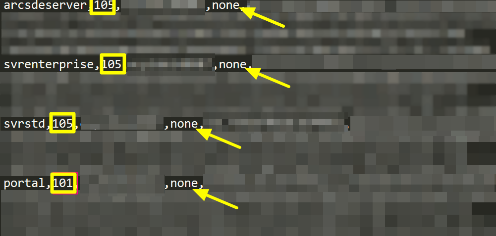

ArcGIS Enterprise 手動更新授權檔案
=================================

1. 複製ArcGIS Enterprise授權檔案keycodes，預設路徑如下 
   
    *C:\\Program Files\\ESRI\\License10.5\\sysgen*

2. 將授權檔案keycodes貼到可以編輯的路徑，例如桌面

3. 使用記事本開啟keycodes，會看到類似下方的畫面

   |image0|
 
  - 第一個文字代表軟體元件

  - 方框數字代表軟體版號

      + **101** 表示10.1-10.4的版本

      + **105** 表示10.5以後的版本

  - 箭頭位置文字代表授權到期日

      + **none** 表示不會過期

4. 使用新的授權文字覆寫keycode檔案中的現有文字，然後存檔

5. 將keycode檔案的副檔名改成.ecp

6. 開啟Software Authorization Wizard程式，點選第三個選項 
   `I have received an authorization file and am now 
    ready to finish the authorization process.` ，然後
    選擇你剛改好的keycode.ecp檔案

   |image1|

7. 點選 **下一步** ，出現你會要授權哪些軟體元件

   |image2|

8. 授權確認無誤後，點選 **完成** 按鈕，完成授權更新

.. |image1| image:: ./手動更新授權檔案@enterprise/image2.png
   :width: 3.61111in
   :height: 4.54845in
.. |image2| image:: ./手動更新授權檔案@enterprise/image3.png
   :width: 4.40040in
   :height: 2.30139in
