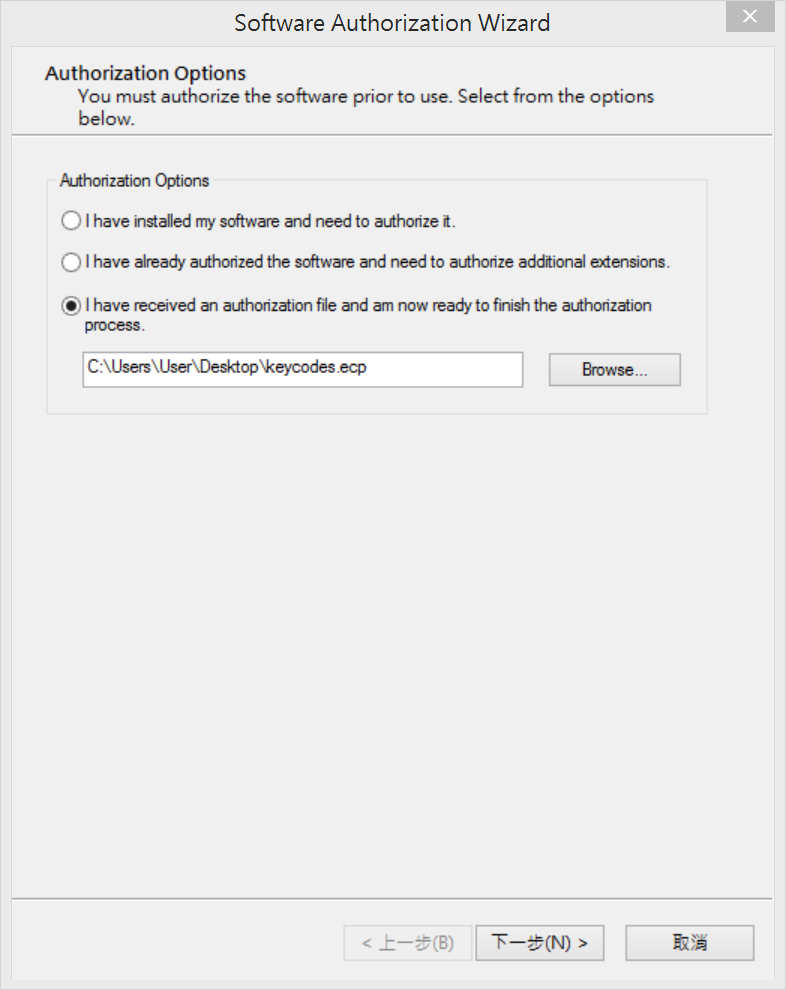
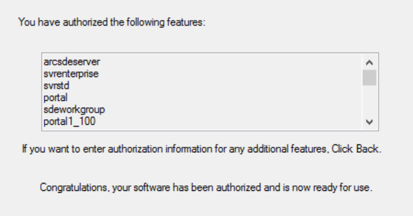

ArcGIS Enterprise 手動更新License檔案
=================================

摘要
-------------

當您的ArcGIS Enterprise已經過期，而您也已經取得新的授權檔案時，您可以跟著以下步驟更新您的授權檔案。授權更新後，您可以登入ArcGIS Server Manager介面確認軟體授權資訊。	

步驟
-------------

1. 複製ArcGIS Enterprise授權檔案keycodes，預設路徑如下 
   
    *C:\\Program Files\\ESRI\\License10.5\\sysgen*

2. 將授權檔案keycodes貼到可以編輯的路徑，例如桌面

3. 開啟Software Authorization Wizard程式，點選第三個選項 
   `I have received an authorization file and am now ready to finish the authorization process.` ，然後選擇新的授權檔案，副檔名為.ecp

   |image1|

7. 點選 **下一步** ，出現你會要授權哪些軟體元件

   |image2|

8. 授權確認無誤後，點選 **完成** 按鈕，完成授權更新

