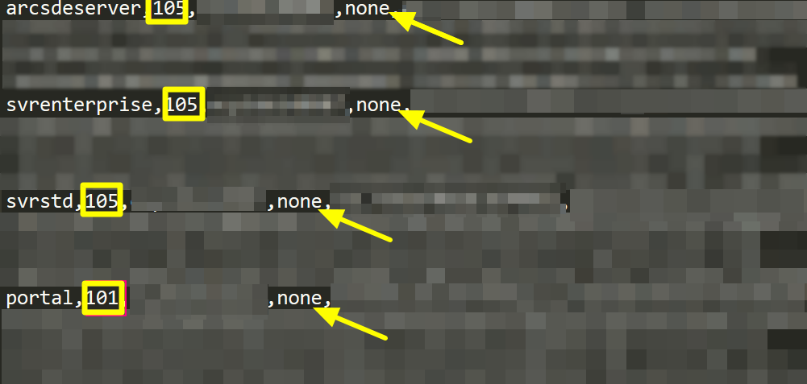
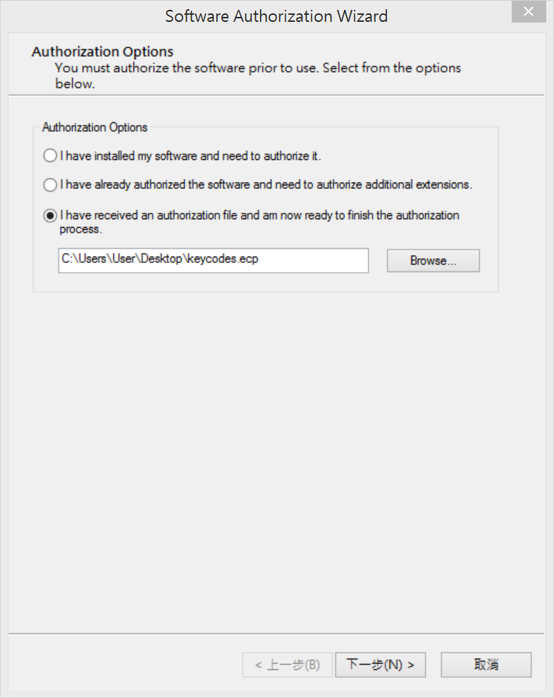
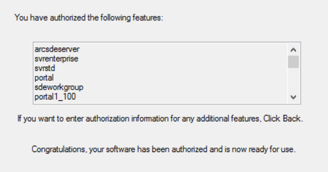

ArcGIS Enterprise手動更新授權檔案
=================================

1. 複製ArcGIS Enterprise授權檔案keycodes，預設路徑如下

    .. code-block:: 
       C:\\Program Files\\ESRI\\License10.5\\sysgen

2. 將授權檔案貼到可以編輯的路徑，例如桌面

3. 使用記事本開啟keycodes，會看到類似下方的畫面

   第一個文字代表軟體元件

   方框數字代表軟體版號

    -  101表示10.1-10.4的版本

    -  105表示10.5以後的版本

       箭頭位置文字代表授權到期日

    -  none表示不會過期

    |image0|

4. 覆寫keycode檔案中授權字樣，然後存檔。

5. 將keycode檔案副檔名改成.ecp

6. 開啟Software Authorization
   Wizard程式，選擇`第三個選項`，然後指定你剛改好的keycode.ecp檔案

    |image1|

7. 點選下一步

8. 出現你會要授權哪些軟體元件

    |image2|

9. 點選完成按鈕，完成授權更新

