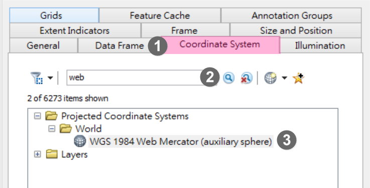
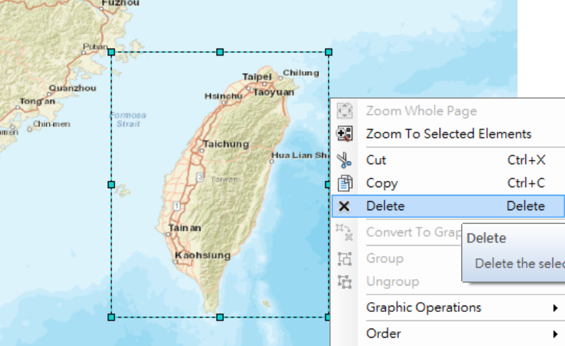
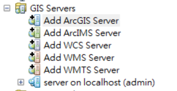
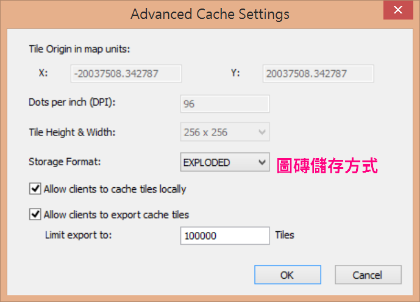
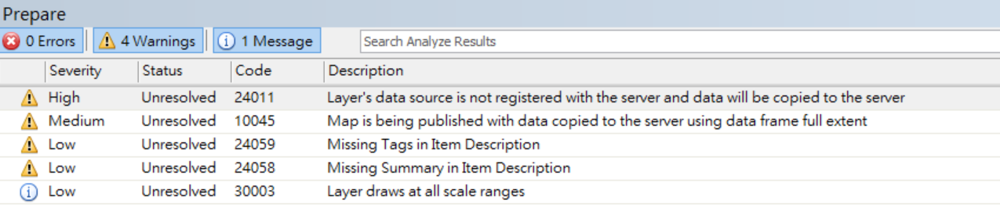
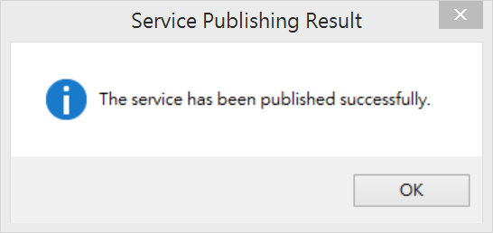
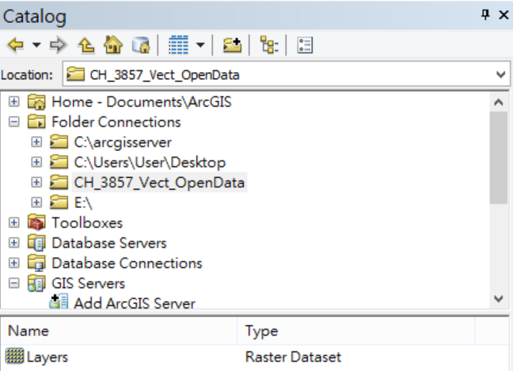
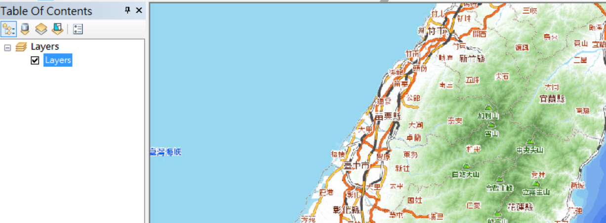
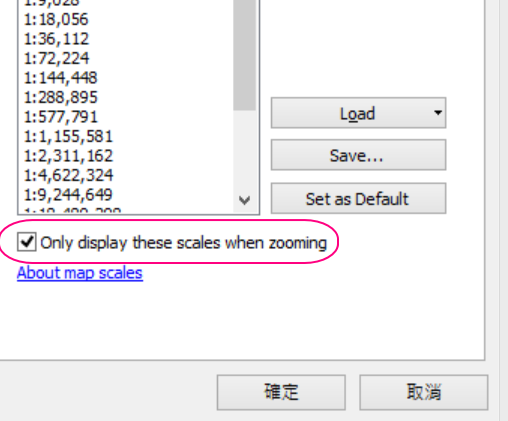

通用版電子地圖ArcGIS封裝檔使用方式
==================================

資料介紹
--------

通用版電子地圖ArcGIS封裝檔是國土測繪中心製作公開的資料，允許使用者在電腦、行動裝置上離線瀏覽地圖。下載來的檔案解壓縮後，目錄結構會類似下圖，此為ArcGIS
Cache Service的檔案結構。

    |image0|

由於國土測繪沒有附上Cache
Service的圖磚定義檔案(Conf.xml與conf.cdi)，所以使用者需要自己建立或，或是直接\ `*下載已經建立好的定義檔* <https://drive.google.com/drive/folders/1BiopRK44EYJUWZTo1gX_88_2-hAQSbix?usp=sharing>`__\ ，才能在ArcMap或是對應軟體中開啟地圖資料。

以下小節會介紹如何自己建立圖磚定義檔案，並說明建立圖磚定義檔時，需要注意那些細節。

建立圖磚定義檔需要注意的細節
----------------------------

圖磚定義檔建立時，需要確定以下幾件事情：

1. 圖層座標系統。通用版電子地圖使用EPSG:3857座標系統。

2. 每一層(Level)的裁切比例尺與解析度。本文通用版電子地圖依據Google
   Map的比例進行裁切。

3. 圖片格式，本文通用版電子地圖使用jpg格式作為圖磚的圖片格式。

4. 圖磚儲存方式是EXPLODED或是COMPACT，EXPLODED直接將每張圖片儲存在資料夾內，COMPACT則是將一個的圖片壓縮成一個bundle檔案儲存。本文中的通用版電子地圖採用EXPLODED方式儲存圖片。

了解以上幾件事情後，就可以按照以下小節瀏覽電子地圖。

使用方法一：發佈為ArcGIS Server服務
-----------------------------------

下載圖磚圖片檔案
~~~~~~~~~~~~~~~~

1. 到國土測繪中心網站\ `*https://maps.nlsc.gov.tw/* <https://maps.nlsc.gov.tw/>`__

2. 點選下載專區

3. 找到以下兩個清單項目，點選右邊下載連結即可下載

[政府開放資料]臺灣通用電子地圖(套疊等高線)圖磚封裝檔(GIS用)

[政府開放資料]臺灣通用電子地圖(不含等高線)圖磚封裝檔(GIS用)

    |image1|

I.  .. rubric:: 
       :name: section-1

II. .. rubric:: 建立Web Mercator座標系統的地圖圖框
       :name: 建立web-mercator座標系統的地圖圖框

1. 開啟ArcMap

2. 在Table Of Contents視窗中，對Layers圖框按滑鼠右鍵，選擇Properties

    |image2|

3. 定義地圖框坐標系統

    A. 在Data Frame Properties視窗中，切換到Coordinate System

    B. 在搜尋列中，輸入"web"，然後點選右邊的搜尋按鈕

    C. 找到如下圖所示的座標系統定義檔，然後按確定

    |image3|

I.  .. rubric:: 
       :name: section-2

II. .. rubric:: 產生台灣全島範圍Featrue Class
       :name: 產生台灣全島範圍featrue-class

1. 加入 Streets底圖

    |image4| |image5|

2. 調整地圖範圍涵蓋台灣全島

3. 啟用Draw工具列

    |image6|

4. 使用矩形工具，在地圖上繪製台灣本島範圍

    |image7| |image8|

5. 使用Convert Graphics To Features工具，將矩形圖形轉換成Feature Class

    |image9|

6. 工具參數設定如下，本文中輸出的Feature Class命名為TaiwanExtent

    |image10|

7. 將TaiwanExtent圖層加入圖框中

    |image11|

8. 移除稍早所繪製的矩形圖形

    |image12|

產生地圖文件檔案mxd
~~~~~~~~~~~~~~~~~~~

1. 移除底圖，TOC視窗中僅留下TaiwanExtent圖層

    |image13|

2. 將地圖縮放至TaiwanExtent圖層範圍

    |image14|

3. 將TaiwanExtent圖層邊框與填充色設為透明

    |image15|

4. 儲存地圖，本文將地圖文件檔取名為NLSC\_Basemap.mxd

發佈地圖快取服務
~~~~~~~~~~~~~~~~

1. 新增ArcGIS for Server連線，需要Publish以上的權限

    |image16|

2. 上方工具列中，點選File > Share As > Service

    |image17|

3. 選擇Publish Service，點選下一步

    |image18|
 
4. 選擇稍早建立的ArcGIS
   Server連線，並輸入此次要發佈的服務名稱。此名稱建議使用英文，本文使用NLSC\_Basemap作為此服務名稱。然後點選下一步。

    |image19|

5. 選擇GIS服務要放在哪一個目錄內，本文將放在Basemap目錄內。然後點選Continue。

    |image20|

6. 設定Caching選項

    A. 左側視窗中，選擇Caching。

    B. 右側視窗中，選擇Using tiles from a cache

    C. 快取圖層定義檔設成ArcGIS Online/Bing Maps/Google Maps

    D. 設定要產生的圖磚層數

    E. 選擇手動產生圖磚

    |image21|
 
7. 設定Caching > Advanced Settings選項

    A. 由於國土測繪中心所給定的圖片為jpg格式，所以此處將圖片格式設定為jpeg

    B. 點選Advanced按鈕，開啟進階設定

    |image22|

    C. 由於國土測繪中心使用每一個圖磚以一張圖片的方式，儲存在資料夾中，故此處將圖磚儲存方式設定為EXPLODED。

    |image23|

    D. 完成Caching設定後，在Service Editor中點選Analyze按鈕，檢查服務設定上是否有錯誤或需要改進的地方。

    |image24|

    |image25|

    E. 如果沒有出現Error，則在Service Editor中，點選Publish按鈕發佈服務

    |image26|

    F. 發佈過程中，出現要將TaiwanExtent這筆資料複製到主機上，點選OK繼續發佈過程

    |image27|

    G. 出現服務發佈成功對話視窗，點選OK完成服務發佈。

    |image28|

I.  .. rubric:: 
       :name: section-3

II. .. rubric:: 複製圖磚檔案到ArcGIS Server主機上
       :name: 複製圖磚檔案到arcgis-server主機上

1. 連線到ArcGIS Server主機

2. 預設情況下，在C:\\arcgisserver\\directories\\arcgiscache中，會找到剛才發佈的快取服務存放圖磚的資料夾位置。

    |image29|

3. 點開此服務資料夾至Layers資料夾內，會看到如下圖的資料夾結構。

    |image30|

4. 將從國土測繪中心網站下載的圖磚檔案，複製到\_alllayers資料夾內即可。

    |image31|

5. 從瀏覽器上瀏覽服務，即可看到通用版地圖。

    |image32|

使用方法二、透過ArcMap瀏覽
--------------------------

建立ArcGIS Raster Dataset資料夾結構
~~~~~~~~~~~~~~~~~~~~~~~~~~~~~~~~~~~

1. 下載圖磚定義檔\ *conf.cdi*\ 與\ `*Conf.xml* <https://drive.google.com/file/d/1wmQRCnEzHaw0I2Ch5jPUNdlMoo0XSqby/view?usp=sharing>`__

2. 建立一個名稱為Layers的資料夾

3. 將conf.cdi與Conf.xml複製到Layers目錄內

4. 在Layers目錄中，建立一個名為"\_alllayers"的資料夾

5. 把下載來的通用版電子地圖L0 ~ L15的資料夾移動到\_alllayers資料夾內

6. 目前Layers資料夾目錄內容應該如下圖所示

    |image33|

I.  .. rubric:: 
       :name: section-4

II. .. rubric:: 開啟ArcMap瀏覽地圖
       :name: 開啟arcmap瀏覽地圖

1. 開啟ArcMap

2. 在Catalog視窗中，連線存放Layers資料夾的根目錄，此時會看到Layers為一個Raster
   Dataset格式

    |image34|

3. 將Layers拖曳至Table of
   Content視窗中，ArcMap會呈現地圖內容。不過目前地圖框縮放比例與圖磚裁切比例不符，因此圖層在顯示上會產生模糊的情況。

    |image35|

4. 調整第圖框的縮放比例，讓圖層可以使用正確比例顯示。

    A. 點選比例尺下拉選單，選擇Customize The List…

    |image36|

    B. 點選Delete All刪除現有顯示比例

    |image37|
 
    C. 點選Load ArcGIS Online/Bing Maps/Google Maps載入ArcGIS
   Online底圖圖磚比例

    |image38|

    D. 將Only display these scales when zooming打勾，並按確定

    |image39|

5. 現在通用版電子地圖會清楚地呈現囉！

    |image40|

.. |image1| image:: ./國土測繪中心圖磚使用方式/image2.png
   :width: 5.52550in
   :height: 1.80764in
.. |image2| image:: ./國土測繪中心圖磚使用方式/image3.png
   :width: 1.91667in
   :height: 3.08973in

.. |image5| image:: ./國土測繪中心圖磚使用方式/image6.png
   :width: 2.95139in
   :height: 1.32246in
.. |image6| image:: ./國土測繪中心圖磚使用方式/image7.png
   :width: 2.01389in
   :height: 1.04041in
.. |image7| image:: ./國土測繪中心圖磚使用方式/image8.png
   :width: 1.31250in
   :height: 2.15421in
.. |image8| image:: ./國土測繪中心圖磚使用方式/image9.png
   :width: 2.50000in
   :height: 2.15865in
.. |image9| image:: ./國土測繪中心圖磚使用方式/image10.png
   :width: 1.63194in
   :height: 1.47950in
.. |image10| image:: ./國土測繪中心圖磚使用方式/image11.png
   :width: 3.18750in
   :height: 2.79405in
.. |image11| image:: ./國土測繪中心圖磚使用方式/image12.png
   :width: 2.94193in
   :height: 1.11458in

.. |image17| image:: ./國土測繪中心圖磚使用方式/image18.png
   :width: 3.73730in
   :height: 1.92361in
.. |image18| image:: ./國土測繪中心圖磚使用方式/image19.png
   :width: 4.83333in
   :height: 3.17361in
.. |image19| image:: ./國土測繪中心圖磚使用方式/image20.png
   :width: 4.14808in
   :height: 3.36111in

.. |image21| image:: ./國土測繪中心圖磚使用方式/image22.png
   :width: 5.61091in
   :height: 4.61319in
.. |image22| image:: ./國土測繪中心圖磚使用方式/image23.png
   :width: 4.80850in
   :height: 3.95347in

.. |image27| image:: ./國土測繪中心圖磚使用方式/image28.png
   :width: 4.46875in
   :height: 1.31255in

.. |image31| image:: ./國土測繪中心圖磚使用方式/image32.png
   :width: 4.16667in
   :height: 2.57014in

.. |image36| image:: ./國土測繪中心圖磚使用方式/image37.png
   :width: 2.64583in
   :height: 1.97795in
.. |image37| image:: ./國土測繪中心圖磚使用方式/image38.png
   :width: 2.75591in
   :height: 3.77718in
.. |image38| image:: ./國土測繪中心圖磚使用方式/image39.png
   :width: 3.14961in
   :height: 3.00548in

.. |image40| image:: ./國土測繪中心圖磚使用方式/image41.png
   :width: 4.38889in
   :height: 2.52339in
