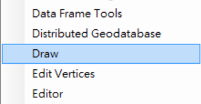
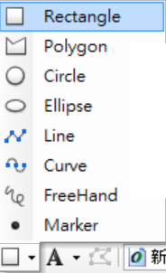
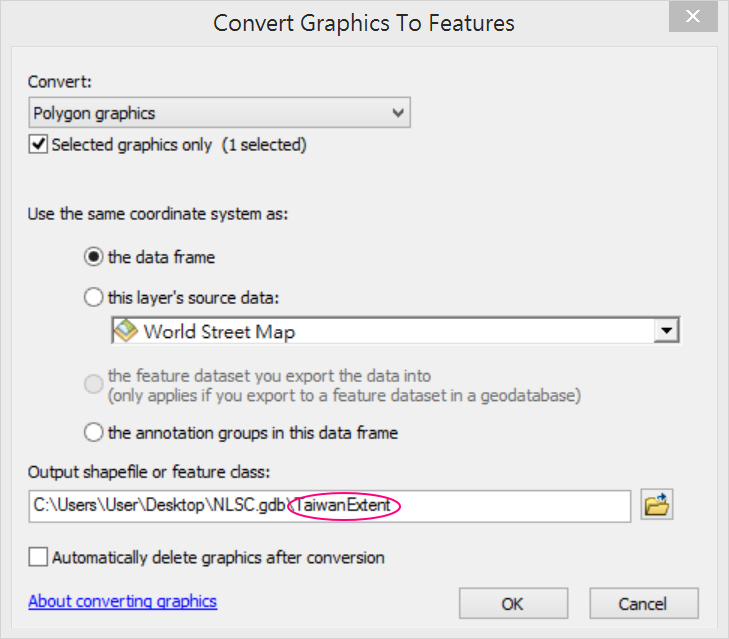
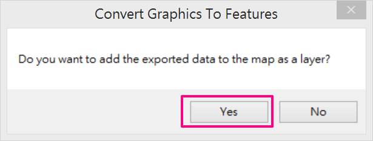
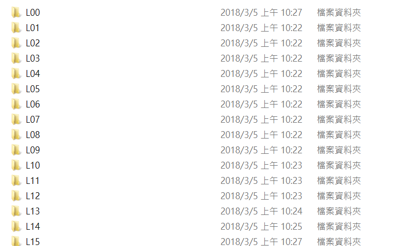

使用方法一、發佈為ArcGIS Server服務
===================================

下載圖磚圖片檔案
----------------

1. 到國土測繪中心網站\ `https://maps.nlsc.gov.tw/ <https://maps.nlsc.gov.tw/>`__

2. 點選下載專區

3. 找到以下兩個清單項目，點選右邊下載連結即可下載

[政府開放資料]臺灣通用電子地圖(套疊等高線)圖磚封裝檔(GIS用)

[政府開放資料]臺灣通用電子地圖(不含等高線)圖磚封裝檔(GIS用)

    |image0|

建立Web Mercator座標系統的地圖圖框
----------------------------------

1. 開啟ArcMap

2. 在Table Of Contents視窗中，對Layers圖框按滑鼠右鍵，選擇Properties

    |image1|

3. 定義地圖框坐標系統

    A. 在Data Frame Properties視窗中，切換到Coordinate System

    B. 在搜尋列中，輸入"web"，然後點選右邊的搜尋按鈕

    C. 找到如下圖所示的座標系統定義檔，然後按確定

    |image2|

產生台灣全島範圍Featrue Class
-----------------------------

1. 加入 Streets底圖

    |image3| |image4|

2. 調整地圖範圍涵蓋台灣全島

3. 啟用Draw工具列

    |image5|

4. 使用矩形工具，在地圖上繪製台灣本島範圍

    |image6| |image7|
 
5. 使用Convert Graphics To Features工具，將矩形圖形轉換成Feature Class

    |image8|

6. 工具參數設定如下，本文中輸出的Feature Class命名為TaiwanExtent

    |image9|

7. 將TaiwanExtent圖層加入圖框中

    |image10|

8. 移除稍早所繪製的矩形圖形

    |image11|

產生地圖文件檔案mxd
-------------------

1. 移除底圖，TOC視窗中僅留下TaiwanExtent圖層

    |image12|

2. 將地圖縮放至TaiwanExtent圖層範圍

    |image13|

3. 將TaiwanExtent圖層邊框與填充色設為透明

    |image14|

4. 儲存地圖，本文將地圖文件檔取名為NLSC\_Basemap.mxd
 

發佈地圖快取服務
----------------

1. 新增ArcGIS for Server連線，需要Publish以上的權限

    |image15|

2. 上方工具列中，點選File > Share As > Service

    |image16|

3. 選擇Publish Service，點選下一步

    |image17|
 
4. 選擇稍早建立的ArcGIS
   Server連線，並輸入此次要發佈的服務名稱。此名稱建議使用英文，本文使用NLSC\_Basemap作為此服務名稱。然後點選下一步。

    |image18|

5. 選擇GIS服務要放在哪一個目錄內，本文將放在Basemap目錄內。然後點選Continue。

    |image19|

6. 設定Caching選項

    A. 左側視窗中，選擇**Caching**

    B. 右側視窗中，選擇**Using tiles from a cache**

    C. 快取圖層定義檔設成**ArcGIS Online/Bing Maps/Google Maps**

    E. 設定要產生的圖磚層數

    F. 選擇手動產生圖磚

    |image20|

7. 設定Caching > Advanced Settings選項

    A. 由於國土測繪中心所給定的圖片為jpg格式，所以此處將圖片格式設定為jpeg

    B. 點選Advanced按鈕，開啟進階設定

    |image21|

    C. 由於國土測繪中心使用每一個圖磚以一張圖片的方式，儲存在資料夾中，故此處將圖磚儲存方式設定為EXPLODED。

    |image22|

    D. 完成Caching設定後，在Service
   Editor中點選**Analyze**按鈕，檢查服務設定上是否有錯誤或需要改進的地方。

    |image23|

    |image24|

    E. 如果沒有出現Error，則在Service Editor中，點選Publish按鈕發佈服務

    |image25|

    F. 發佈過程中，出現要將TaiwanExtent這筆資料複製到主機上，點選OK繼續發佈過程

    |image26|

    G. 出現服務發佈成功對話視窗，點選OK完成服務發佈。

    |image27|

複製圖磚檔案到ArcGIS Server主機上
---------------------------------

1. 連線到ArcGIS Server主機

2. 預設情況下，在C:\\arcgisserver\\directories\\arcgiscache中，會找到剛才發佈的快取服務存放圖磚的資料夾位置。

    |image28|

3. 點開此服務資料夾至Layers資料夾內，會看到如下圖的資料夾結構。

    |image29|

4. 將從國土測繪中心網站下載的圖磚檔案，複製到\_alllayers資料夾內即可。

    |image30|
 
5. 從瀏覽器上瀏覽服務，即可看到通用版地圖。

    |image31|

.. |image2| image:: ./03_使用方法一、發佈為ArcGISServer服務/image3.png
   :width: 4.46757in
   :height: 2.27917in
.. |image3| image:: ./03_使用方法一、發佈為ArcGISServer服務/image4.png
   :width: 2.86542in
   :height: 1.34028in

.. |image11| image:: ./03_使用方法一、發佈為ArcGISServer服務/image12.png
   :width: 3.38721in
   :height: 1.38889in
.. |image12| image:: ./03_使用方法一、發佈為ArcGISServer服務/image13.png
   :width: 2.26389in
   :height: 1.48940in
.. |image13| image:: ./03_使用方法一、發佈為ArcGISServer服務/image14.png
   :width: 3.87153in
   :height: 1.52872in
.. |image14| image:: ./03_使用方法一、發佈為ArcGISServer服務/image15.png
   :width: 3.17708in
   :height: 2.12500in
.. |image15| image:: ./03_使用方法一、發佈為ArcGISServer服務/image16.png
   :width: 3.48889in
   :height: 1.70833in

.. |image19| image:: ./03_使用方法一、發佈為ArcGISServer服務/image20.png
   :width: 4.63611in
   :height: 1.02750in

.. |image22| image:: ./03_使用方法一、發佈為ArcGISServer服務/image23.png
   :width: 3.99395in
   :height: 2.86944in
.. |image23| image:: ./03_使用方法一、發佈為ArcGISServer服務/image24.png
   :width: 5.03889in
   :height: 0.47618in
.. |image24| image:: ./03_使用方法一、發佈為ArcGISServer服務/image25.png
   :width: 5.03013in
   :height: 1.06528in
.. |image25| image:: ./03_使用方法一、發佈為ArcGISServer服務/image26.png
   :width: 5.44861in
   :height: 0.51490in
.. |image26| image:: ./03_使用方法一、發佈為ArcGISServer服務/image27.png
   :width: 4.46875in
   :height: 1.31255in
.. |image27| image:: ./03_使用方法一、發佈為ArcGISServer服務/image28.png
   :width: 4.11499in
   :height: 1.94444in
.. |image28| image:: ./03_使用方法一、發佈為ArcGISServer服務/image29.png
   :width: 3.47917in
   :height: 0.61111in
.. |image29| image:: ./03_使用方法一、發佈為ArcGISServer服務/image30.png
   :width: 2.01389in
   :height: 1.73958in

.. |image31| image:: ./03_使用方法一、發佈為ArcGISServer服務/image32.png
   :width: 6.03348in
   :height: 2.84722in
