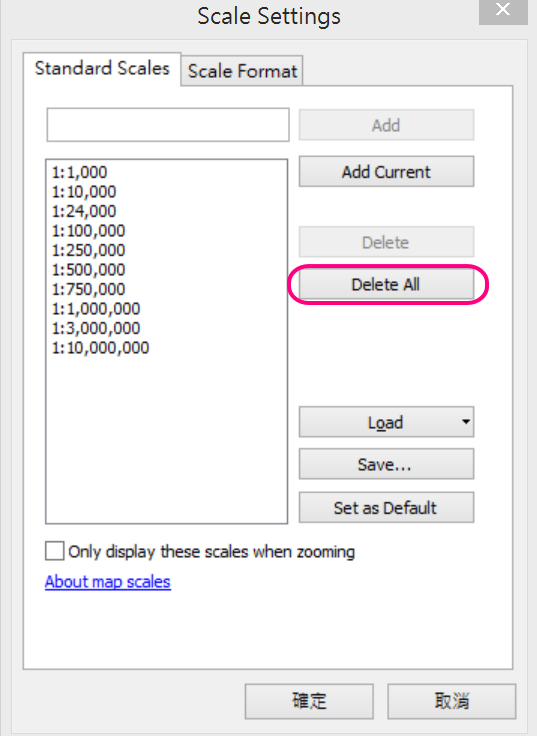
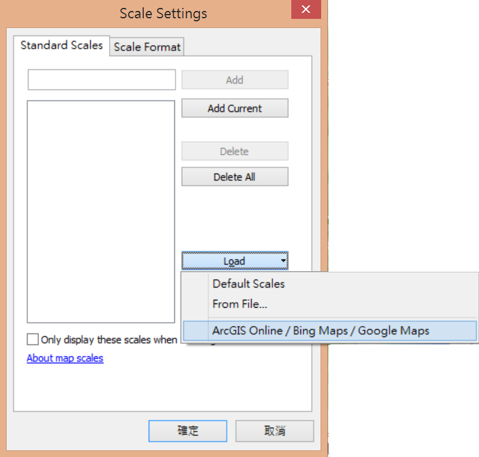

使用方法二、透過ArcMap瀏覽
==========================

建立ArcGIS Raster Dataset資料夾結構
-----------------------------------

1. 下載圖磚定義檔\ `conf.cdi <https://drive.google.com/open?id=1sYqZG7zAz0TeG3brK7dHLuQpyx25oD5Y>`__\ 與\ `Conf.xml <https://drive.google.com/file/d/1wmQRCnEzHaw0I2Ch5jPUNdlMoo0XSqby/view?usp=sharing>`__

2. 建立一個名稱為**Layers**的資料夾

3. 將**conf.cdi**與**Conf.xml**複製到Layers目錄內

4. 在Layers目錄中，建立一個名為 **\_alllayers** 的資料夾

5. 把下載來的通用版電子地圖L0 ~ L15的資料夾移動到\_alllayers資料夾內

6. 目前Layers資料夾目錄內容應該如下圖所示

    |image0|

開啟ArcMap瀏覽地圖
------------------

1. 開啟ArcMap

2. 在Catalog視窗中，連線存放Layers資料夾的根目錄，此時會看到Layers為一個Raster
   Dataset格式

    |image1|

3. 將Layers拖曳至Table of
   Content視窗中，ArcMap會呈現地圖內容。不過目前地圖框縮放比例與圖磚裁切比例不符，因此圖層在顯示上會產生模糊的情況。

    |image2|
 
4. 調整第圖框的縮放比例，讓圖層可以使用正確比例顯示。

    A. 點選比例尺下拉選單，選擇**Customize The List…**

    |image3|

    B. 點選**Delete All**刪除現有顯示比例

    |image4|

    C. 點選**Load ArcGIS Online/Bing Maps/Google Maps**載入ArcGIS
   Online底圖圖磚比例

    |image5|

    D. 將**Only display these scales when zooming**打勾，並按確定

    |image6|

    E. 現在通用版電子地圖會清楚地呈現囉！

    |image7|

.. |image0| image:: ./04_使用方法二、透過ArcMap瀏覽/image1.png
   :width: 5.93472in
   :height: 0.63695in
.. |image1| image:: ./04_使用方法二、透過ArcMap瀏覽/image2.png
   :width: 3.83316in
   :height: 2.77431in
.. |image2| image:: ./04_使用方法二、透過ArcMap瀏覽/image3.png
   :width: 5.33845in
   :height: 1.97083in

.. |image6| image:: ./04_使用方法二、透過ArcMap瀏覽/image7.png
   :width: 2.48611in
   :height: 2.06034in

